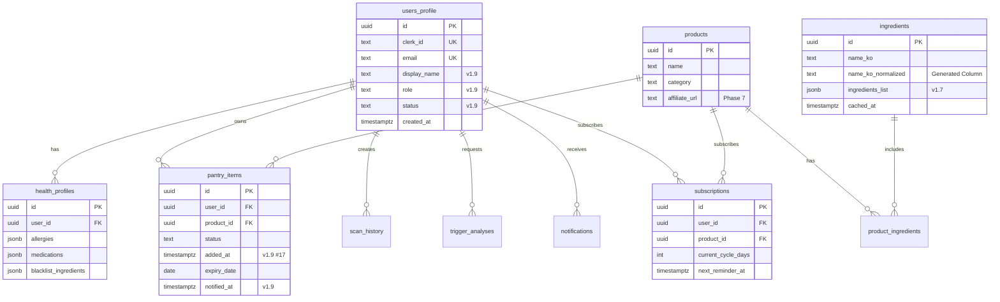

# TEND+ Cursor 구현 패키지 (완전판)

> **쇼핑몰 예시처럼 단계별로 구현하는 TEND+ 프로젝트**  
> Phase 0-14 바이브 코딩 가이드
>
> **✅ todo.md (v1.9) 기준** — @todo.md 참조, 스키마/API 불일치 시 todo.md 우선

---

## 📌 문서 사용 순서

1. **todo.md (v1.9)** — 메인 구현 가이드
2. **SETUP.md** — Cursor 프롬프트·실습 흐름
3. **PACKAGE.md** — 워크플로우·체크리스트
4. **PLAN_MODE.md** — 플랜모드 사용 시 필독 (에러 75%→5% 감소)
5. **HUMAN_TASKS.md** — [HUMAN] 수동 작업 시 단계별 가이드
6. **CURSOR_LIMITS.md** — Cursor가 못하는 것 (에러 시 참조)

> **스키마/API 불일치 시:** todo.md 우선  
> **플랜모드 사용 시:** PLAN_MODE.md 먼저 참조  
> **[HUMAN] 알림 시:** HUMAN_TASKS.md 열어서 수동 작업 진행  
> **에러/한계:** CURSOR_LIMITS.md 확인

---

## 📋 Phase별 Cursor 프롬프트 예시

### Phase 1: 데이터베이스

**Step 1: 스키마 파일 생성**
```
@todo.md Phase 1.1.1을 구현해줘.

schema-tendplus-v1.9.sql 파일을 생성해줘.

CRITICAL:
1. users_profile 먼저 생성
2. ingredients.name_ko_normalized GENERATED ALWAYS AS ... STORED
3. ingredients.ingredients_list (NOT ingredients!)
4. pantry_items.notified_at (NOT notified!)

테이블 생성 순서:
- users_profile
- ingredients (Generated Column)
- products
- notifications
- health_profiles
- pantry_items
- scan_history
- product_ingredients

헬퍼 함수 3개:
- get_current_user_id()
- get_table_columns()
- get_expiring_items_kst()
```

**Step 2: 검증**
```
Phase 1.1.2 검증을 진행해줘.

Supabase SQL Editor에서 아래 SQL 실행 (psql 명령어 \dt, \d 미지원):

1. SELECT tablename FROM pg_tables WHERE schemaname = 'public' ORDER BY tablename;
   → 8개 테이블 확인

2. SELECT column_name, is_generated FROM information_schema.columns 
   WHERE table_schema = 'public' AND table_name = 'ingredients' AND column_name = 'name_ko_normalized';
   → is_generated = 'ALWAYS'
```

### Phase 2: 미들웨어

**Step: middleware 생성**
```
@todo.md Phase 2.4.1을 구현해줘.

src/middleware.ts를 생성해줘.

🔴 CRITICAL: '/api/cron(.*)' 반드시 포함!
없으면 Phase 5 Cron 요청 401 에러 발생!

const isPublicRoute = createRouteMatcher([
  '/',
  '/sign-in(.*)',
  '/sign-up(.*)',
  '/api/webhooks(.*)',
  '/api/cron(.*)',  // 🔴 필수!
]);

생성 후 pnpm verify 2 실행하여 검증!
```

---

## 📦 필요한 파일 전체 목록

### 1. 기반 문서

```
✅ PRD.md (Product Requirements Document)
✅ ERD.mermaid (데이터베이스 다이어그램)
✅ schema-tendplus-v1.9.sql (데이터베이스 스키마 — todo.md Phase 1 참조)
✅ todo.md (전체 구현 계획 — v1.9, 수정 #1~#22 반영)
✅ .cursorrules (개발 규칙)
✅ PLAN_MODE.md (플랜모드 구현 가이드 — 플랜모드 사용 시 필독)
✅ HUMAN_TASKS.md ([HUMAN] 수동 작업 단계별 가이드)
✅ CURSOR_LIMITS.md (Cursor가 못하는 것 — 에러 시 참조)
✅ PHASE_COMPLETION.md (Phase 완료 체크리스트 — Windows 호환)
```

### 2. 설정 파일

```
✅ .env.local (환경변수)
✅ vercel.json (배포 설정)
✅ package.json (패키지 설정)
✅ .gitignore (Git 제외 파일)
```

### 3. 추가 필요 파일

```
🆕 WORKFLOW.md (바이브 코딩 워크플로우)
🆕 PHASE_CHECKLIST.md (단계별 체크리스트)
🆕 PROMPT_TEMPLATES.md (프롬프트 템플릿)
```

---

## 📝 1. PRD.md 생성

```markdown
# TEND+ v1.9 PRD (Product Requirements Document)

## 📋 프로젝트 개요

### 목적

- **핵심 목표**: 성분 분석으로 건강 관리 지원
- **검증 가설**: OCR + AI로 성분 위험도 자동 판별
- **출시 형태**: MVP (Phase 0-6, 4주 완성)

### 핵심 가치

- 카메라로 제품 촬영 → 즉시 성분 분석
- 개인 건강 프로필 기반 위험 성분 알림
- 유통기한 관리 + 자동 알림

---

## 🎯 타겟 사용자

### Primary User

- **연령대**: 20-40대
- **특징**: 알레르기/민감성 피부 보유
- **니즈**: 제품 성분 확인 시간 절약

---

## 🏗️ 기술 스택

### Package Manager

- pnpm

### Frontend

- Next.js 14 (App Router)
- TypeScript
- Tailwind CSS

### Backend & Database

- Supabase (PostgreSQL)
- RLS 사용 (Row Level Security)

### 인증

- Clerk (로그인/회원가입)
- JWT Template (supabase)

### AI

- Google Gemini 2.0 Flash (OCR + 성분 분석)

### Rate Limiting

- Upstash Redis (10 req/min)

### 외부 API

- 식약처 API (선택사항)

---

## 🚀 개발 우선순위

### Phase 0: 프로젝트 초기화 (1일)

- [ ] Next.js 프로젝트 생성
- [ ] 패키지 설치
- [ ] 환경변수 설정
- [ ] .cursorrules 생성

### Phase 1: 데이터베이스 (1일)

- [ ] Supabase 프로젝트 생성
- [ ] 스키마 생성 (v1.9)
- [ ] RLS 정책 적용
- [ ] Storage 버킷 생성

### Phase 2: 인증 (1일)

- [ ] Clerk 연동
- [ ] JWT Template 설정
- [ ] Webhook 설정
- [ ] 미들웨어 설정

### Phase 3: AI 기능 (2일)

- [ ] Rate Limiter 구현
- [ ] 이미지 리사이징 (클라이언트)
- [ ] Gemini OCR API
- [ ] 카메라 UI

### Phase 4: 식약처 API (1일)

- [ ] 식약처 API 연동
- [ ] 캐시 전략

### Phase 5: Cron Job (1일)

- [ ] 유통기한 체크 Cron
- [ ] 알림 생성

### Phase 6: 배포 (1일)

- [ ] 코드 검증
- [ ] Vercel 배포
- [ ] 전체 기능 테스트

**총 예상 개발 기간: 4주 (MVP)**

---

## 📈 성공 지표 (MVP 검증 기준)

### 정량적 지표

- 회원가입: 최소 50명
- OCR 스캔: 최소 100건
- 성분 분석 정확도: 80% 이상
- 유통기한 알림 발송: 90% 이상

### 정성적 지표

- 사용자 피드백 수집
- 주요 개선 포인트 파악
- 기술 스택 검증

---

## 🚨 제약사항

### v1.9 핵심 규칙
```

✅ ingredients_list (NOT ingredients!)
✅ notified_at (NOT notified!)
✅ name_ko_normalized (Generated Column)
✅ .maybeSingle() (NOT .single()!)
✅ \*.client.ts → Browser only
✅ createAdminClient → /api/admin, /api/cron only
✅ Rate Limit Fail Closed (20회)
✅ pnpm ONLY (NOT npm!)

```

### MVP 제외 기능
- 어드민 백오피스 (Phase 8)
- 가변형 구독 (Phase 11)
- Chrome Extension (Phase 13)
- B2B 수익화 (Phase 14)

---

## 📦 개발 시작하기

1. 외부 서비스 준비 (Supabase, Clerk, Gemini, Upstash)
2. Phase 0부터 순차적으로 진행
3. 각 Phase 완료 시 TODO.md 체크
4. Git 커밋 (Phase 단위)
5. Phase 6 완료 → MVP 런칭!
```

---

## 📊 2. ERD.mermaid 생성



---

## 🔧 3. WORKFLOW.md 생성

```markdown
# TEND+ 바이브 코딩 워크플로우

## 🎯 전체 흐름
```

1. 기반 문서 확인 (@PRD.md, @todo.md)
   ↓
2. Phase별 구현 계획 세우기 (Planmode)
   ↓
3. todo.md에 상세 계획 업데이트
   ↓
4. Cursor Composer로 구현 진행
   ↓
5. 로컬 테스트 (pnpm dev)
   ↓
6. todo.md 체크 (완료 표시)
   ↓
7. Git 커밋 (Phase 단위)
   ↓
8. 다음 Phase로 이동

````

---

## 📋 Phase별 상세 워크플로우

### Phase 0: 프로젝트 초기화

#### Step 1: 프로젝트 생성
```bash
# Cursor에서 프롬프트
Next.js 14 프로젝트를 생성해줘.
- TypeScript, Tailwind CSS, App Router, src 디렉토리 사용
- pnpm 사용
````

#### Step 2: 패키지 설치

```bash
# Cursor에서 프롬프트
@todo.md Phase 0.1.2를 구현해줘.
필수 패키지들을 pnpm으로 설치하고 package.json에 packageManager 추가해줘.
```

#### Step 3: 설정 파일 생성

```bash
# Cursor에서 프롬프트
@todo.md Phase 0.2-0.3을 구현해줘.
- .env.local 템플릿 생성
- .cursorrules 생성 (v1.9 규칙 포함)
- vercel.json 생성
```

#### Step 4: 검증

```bash
pnpm dev
# http://localhost:3000 접속 확인
```

#### Step 5: TODO 업데이트 & 커밋

```bash
# todo.md에서 Phase 0 체크
- [x] 0.1.1 프로젝트 생성
- [x] 0.1.2 패키지 설치
- [x] 0.2.1 환경변수 설정
- [x] 0.3.1 .cursorrules 생성

# Git 커밋
git add .
git commit -m "feat: Phase 0 - 프로젝트 초기화 완료"
```

---

### Phase 1: 데이터베이스

#### Step 1: 구현 계획 (Planmode)

```bash
# Cursor에서 프롬프트 (Planmode)
@todo.md Phase 1 - 데이터베이스를 구현하겠습니다.

구현 목표:
1. schema-tendplus-v1.9.sql 파일 생성
2. Generated Column (name_ko_normalized) 포함
3. get_current_user_id() 함수 생성
4. RLS 정책 적용

참고:
- @PRD.md
- @schema-tendplus-v1.9.sql (생성할 파일)

검증:
- Supabase SQL Editor에서 스키마 실행
- pg_tables SQL로 테이블 확인
- information_schema로 name_ko_normalized Generated Column 확인
```

#### Step 2: 스키마 파일 생성

```bash
# Cursor에서 프롬프트
schema-tendplus-v1.9.sql 파일을 생성해줘.

CRITICAL:
1. users_profile 먼저 생성
2. ingredients.name_ko_normalized GENERATED ALWAYS AS ... STORED
3. ingredients.ingredients_list (NOT ingredients!)
4. pantry_items.notified_at (NOT notified!)
5. get_current_user_id() 함수
6. get_table_columns() 함수 (v1.7 신규)
7. get_expiring_items_kst() 함수

테이블 생성 순서:
- users_profile
- ingredients (Generated Column)
- products
- health_profiles
- pantry_items
- 기타 테이블
```

#### Step 3: Supabase에서 스키마 실행

```bash
# 수동 작업
1. Supabase Dashboard → SQL Editor
2. schema-tendplus-v1.9.sql 내용 복사
3. Run 실행
4. 검증 (Supabase SQL Editor에서 SQL 실행):
   SELECT tablename FROM pg_tables WHERE schemaname = 'public';
   SELECT column_name, is_generated FROM information_schema.columns
   WHERE table_schema = 'public' AND table_name = 'ingredients' AND column_name = 'name_ko_normalized';
```

#### Step 4: RLS 정책 생성

```bash
# Cursor에서 프롬프트
@todo.md Phase 1.2 - RLS 정책을 생성해줘.

get_current_user_id() 함수 사용.
users_profile: 본인만
health_profiles: 본인만
pantry_items: 본인 CRUD
ingredients/products: 공개 READ
```

#### Step 5: Storage 버킷 생성

```bash
# Supabase Dashboard → Storage
1. product-images (public)
2. ocr-scans (private)

# RLS 정책 추가 (Cursor 프롬프트)
Storage RLS 정책을 생성해줘.
- product-images: 공개 읽기
- ocr-scans: 본인만 읽기/쓰기
```

#### Step 6: TODO 업데이트 & 커밋

```bash
# todo.md 업데이트
- [x] 1.1.1 스키마 생성
- [x] 1.1.2 검증
- [x] 1.2.1 RLS 정책
- [x] 1.3.1 Storage 버킷

# Git 커밋
git add .
git commit -m "feat: Phase 1 - 데이터베이스 스키마 완료"
```

---

### Phase 2: 인증 (Clerk)

#### Step 1: Clerk 설정 (수동)

```bash
# Clerk Dashboard
1. 프로젝트 생성
2. JWT Template 생성 (supabase)
3. Webhook 설정 (user.created)
4. .env.local에 키 입력
```

#### Step 2: Supabase 클라이언트 생성

```bash
# Cursor에서 프롬프트
@todo.md Phase 2.2 - Clerk 통합을 구현해줘.

구현 파일:
1. src/lib/supabase/client.ts (useSupabaseClient)
2. src/lib/supabase/server.ts (createServerClient, createAdminClient, getCurrentUserId)

주의사항:
- .maybeSingle() 사용 (NOT .single()!)
- JWT template 'supabase' 사용
- getCurrentUserId()는 users_profile에서 clerk_id로 조회
```

#### Step 3: Webhook 구현

```bash
# Cursor에서 프롬프트
@todo.md Phase 2.3 - Webhook을 구현해줘.

구현:
- src/app/api/webhooks/clerk/route.ts
- user.created 이벤트 처리
- users_profile + health_profiles 생성
- Svix 서명 검증
- createAdminClient() 사용
```

#### Step 4: 미들웨어 설정

```bash
# Cursor에서 프롬프트
Clerk 미들웨어를 생성해줘.
src/middleware.ts

# 🔴 CRITICAL: publicRoutes에 /api/cron 반드시 포함!
publicRoutes: /, /sign-in, /sign-up, /api/webhooks, /api/cron
# 없으면 Cron 요청 401 에러
```

#### Step 5: 검증

```bash
# 로컬 테스트
pnpm dev

# 회원가입 테스트
1. 새 계정 생성
2. Supabase에서 users_profile 확인
3. health_profiles 확인
```

#### Step 6: TODO 업데이트 & 커밋

```bash
- [x] 2.1.1 JWT Template 생성
- [x] 2.2.1 Supabase 클라이언트
- [x] 2.3.1 Webhook
- [x] 2.4.1 미들웨어

git commit -m "feat: Phase 2 - Clerk 인증 완료"
```

---

### Phase 3: AI 기능

#### Step 1: Rate Limiter 구현

```bash
# Cursor에서 프롬프트
@todo.md Phase 3.1 - Rate Limiter를 구현해줘.

구현:
- src/lib/api/rate-limiter.ts
- Upstash Redis 사용
- 10 req/min
- Fail Closed after 20 failures

주의사항:
- failOpenCount 변수
- MAX_FAIL_OPEN = 20
- 성공 시 failOpenCount = 0
```

#### Step 2: 이미지 리사이징 구현

```bash
# Cursor에서 프롬프트
@todo.md Phase 3.2 - 클라이언트 이미지 리사이징을 구현해줘.

구현:
- src/lib/utils/image-resize.client.ts
- 파일명 .client.ts 필수!
- 런타임 체크: if (typeof window === 'undefined') throw
- maxWidth 768px, quality 0.8
```

#### Step 3: Gemini OCR API

```bash
# Cursor에서 프롬프트
@todo.md Phase 3.3 - Gemini OCR API를 구현해줘.

구현:
- src/app/api/ai/ocr/route.ts
- Rate limit 체크
- Gemini 2.0 Flash 사용
- JSON 응답 파싱

주의사항:
- checkRateLimit(userId) 호출
- getCurrentUserId() 사용
- 429 에러 처리
```

#### Step 4: 카메라 UI

```bash
# Cursor에서 프롬프트
카메라 컴포넌트를 만들어줘.
src/components/scan/CameraCapture.tsx

react-webcam 사용
resizeImageClient() 호출
/api/ai/ocr 연동
```

#### Step 5: 검증

```bash
pnpm dev

# 테스트
1. 카메라 권한 허용
2. 제품 촬영
3. OCR 결과 확인
```

#### Step 6: TODO 업데이트 & 커밋

```bash
- [x] 3.1.1 Rate Limiter
- [x] 3.2.1 이미지 리사이징
- [x] 3.3.1 OCR API
- [x] 3.4.1 카메라 UI

git commit -m "feat: Phase 3 - AI 기능 완료"
```

---

## 🎯 구현 팁

### 1. Planmode 활용

```
매 Phase마다:
1. Planmode로 계획 세우기
2. 계획 검토
3. todo.md 업데이트
4. 구현 진행
5. 커밋
```

### 2. 프롬프트 패턴

```bash
# 기본 패턴
@todo.md Phase [번호] - [기능]을 구현해줘.

구현 목표:
1. [목표1]
2. [목표2]

주의사항:
- [주의1]
- [주의2]

참고:
- @PRD.md
- @파일명
```

### 3. 에러 해결

```bash
# 에러 발생 시
@파일명 에러가 발생했어.

에러 메시지:
[전체 에러 복사]

터미널 로그:
[터미널 로그 복사]

브라우저 콘솔:
[콘솔 에러 복사]

원인을 찾아서 고쳐줘.
```

### 4. 검증 프롬프트

```bash
@schema-tendplus-v1.9.sql 파일을 기반으로 스키마가 제대로 생성되었는지 확인해줘.

확인 사항:
1. 모든 테이블 생성 확인
2. Generated Column 확인
3. 인덱스 생성 확인
4. RLS 정책 확인
```

---

## 📊 진행 상황 체크

### Phase 0-2 완료 시 (3일)

- ✅ 프로젝트 초기화
- ✅ 데이터베이스 스키마
- ✅ Clerk 인증
- ✅ Webhook 동작

### Phase 3-5 완료 시 (4일)

- ✅ Rate Limiter
- ✅ OCR 스캔
- ✅ 식약처 API
- ✅ Cron Job

### Phase 6 완료 시 (1일)

- ✅ Vercel 배포
- ✅ 전체 기능 테스트
- ✅ MVP 완성!

---

**8주 후 TEND+ 완성!** 💪

````

---

## 📝 4. PHASE_CHECKLIST.md 생성

```markdown
# TEND+ Phase별 체크리스트

## Phase 0: 프로젝트 초기화 ✅

### 0.1 프로젝트 생성
- [ ] Next.js 14 프로젝트 생성
- [ ] TypeScript, Tailwind CSS 확인
- [ ] src 디렉토리 확인
- [ ] pnpm 패키지 매니저 확인

### 0.2 패키지 설치
- [ ] @supabase/supabase-js
- [ ] @clerk/nextjs
- [ ] @google/generative-ai
- [ ] @upstash/ratelimit
- [ ] react-webcam
- [ ] resend (Phase 13 가족 초대 이메일용)
- [ ] 기타 필수 패키지 (todo.md Phase 0.1.2 참조)

### 0.3 설정 파일
- [ ] .env.local 생성
- [ ] .cursorrules 생성
- [ ] vercel.json 생성
- [ ] .gitignore 확인
- [ ] scripts/verify-schema.ts 생성 (todo.md Phase 0.5)

### 0.4 검증
- [ ] pnpm dev 실행 확인
- [ ] localhost:3000 접속 확인
- [ ] 빌드 에러 없음

---

## Phase 1: 데이터베이스 ✅

### 1.1 스키마 생성
- [ ] schema-tendplus-v1.9.sql 생성
- [ ] users_profile 테이블
- [ ] ingredients 테이블 (Generated Column)
- [ ] products 테이블
- [ ] notifications 테이블
- [ ] health_profiles 테이블
- [ ] pantry_items 테이블
- [ ] scan_history 테이블
- [ ] product_ingredients 테이블
- [ ] get_current_user_id() 함수
- [ ] get_table_columns() 함수
- [ ] get_expiring_items_kst() 함수

### 1.2 검증
- [ ] Supabase에서 스키마 실행
- [ ] pg_tables SQL로 테이블 확인
- [ ] information_schema로 name_ko_normalized Generated Column 확인
- [ ] 함수 3개 생성 확인

### 1.3 RLS 정책
- [ ] users_profile RLS
- [ ] health_profiles RLS
- [ ] pantry_items RLS
- [ ] ingredients RLS (공개 READ)
- [ ] products RLS (공개 READ)

### 1.4 Storage
- [ ] product-images 버킷 생성
- [ ] ocr-scans 버킷 생성
- [ ] Storage RLS 정책

---

## Phase 2: 인증 (Clerk) ✅

### 2.1 Clerk 설정
- [ ] Clerk 프로젝트 생성
- [ ] JWT Template 생성 (supabase)
- [ ] Webhook 설정 (user.created)
- [ ] .env.local에 키 입력

### 2.2 Clerk 통합
- [ ] src/lib/supabase/client.ts
- [ ] src/lib/supabase/server.ts
- [ ] createServerClient()
- [ ] createAdminClient()
- [ ] getCurrentUserId()

### 2.3 Webhook
- [ ] src/app/api/webhooks/clerk/route.ts
- [ ] Svix 서명 검증
- [ ] users_profile 생성
- [ ] health_profiles 생성

### 2.4 미들웨어
- [ ] src/middleware.ts
- [ ] publicRoutes 설정

### 2.5 검증
- [ ] 회원가입 테스트
- [ ] Supabase에서 users_profile 확인
- [ ] health_profiles 확인

---

## Phase 3: AI 기능 ✅

### 3.1 Rate Limiter
- [ ] src/lib/api/rate-limiter.ts
- [ ] Upstash Redis 연동
- [ ] 10 req/min 설정
- [ ] Fail Closed (20회)
- [ ] failOpenCount 변수

### 3.2 이미지 리사이징
- [ ] src/lib/utils/image-resize.client.ts
- [ ] 파일명 .client.ts 확인
- [ ] 런타임 체크
- [ ] maxWidth 768px
- [ ] quality 0.8

### 3.3 Gemini OCR
- [ ] src/app/api/ai/ocr/route.ts
- [ ] Rate limit 체크
- [ ] Gemini 2.0 Flash 사용
- [ ] JSON 응답 파싱
- [ ] 429 에러 처리

### 3.4 카메라 UI
- [ ] src/components/scan/CameraCapture.tsx
- [ ] react-webcam 사용
- [ ] resizeImageClient() 호출
- [ ] /api/ai/ocr 연동

### 3.5 검증
- [ ] 카메라 권한 테스트
- [ ] 제품 촬영 테스트
- [ ] OCR 결과 확인
- [ ] Rate Limit 테스트 (11회 요청)

---

## Phase 4: 식약처 API ✅

### 4.1 식약처 연동
- [ ] src/lib/api/mfds.ts
- [ ] fetchFoodIngredients() 함수
- [ ] 24시간 캐시 확인
- [ ] XML 파싱
- [ ] .maybeSingle() 사용
- [ ] ingredients_list 컬럼명 확인

### 4.2 검증
- [ ] 식약처 API 호출 테스트
- [ ] 캐시 동작 확인
- [ ] 에러 핸들링 확인

---

## Phase 5: Cron Job ✅

### 5.1 Pantry Check
- [ ] src/app/api/cron/pantry-check/route.ts
- [ ] CRON_SECRET 인증
- [ ] get_expiring_items_kst(3) 호출
- [ ] 알림 생성
- [ ] notified_at 업데이트

### 5.2 Cron Secret
- [ ] openssl rand -base64 32
- [ ] .env.local에 CRON_SECRET 추가
- [ ] Vercel 환경변수 추가

### 5.3 vercel.json
- [ ] Cron 스케줄 추가 (0 9 * * *)
- [ ] 경로 확인

### 5.4 검증
- [ ] 수동 Cron 호출 테스트
- [ ] 알림 생성 확인

---

## Phase 6: 배포 ✅

### 6.1 코드 검증
- [ ] ingredients_list 확인
- [ ] notified_at 확인
- [ ] .single() 없음
- [ ] normalizeProductName() 없음
- [ ] Generated Column 확인
- [ ] RPC 함수 확인
- [ ] Fail Closed 확인
- [ ] pnpm build 성공

### 6.2 Vercel 배포
- [ ] Git 푸시
- [ ] Vercel 연동
- [ ] 환경변수 설정
- [ ] Clerk Webhook URL 업데이트
- [ ] Vercel Cron 확인

### 6.3 배포 후 검증
- [ ] 회원가입 테스트
- [ ] OCR 테스트
- [ ] Cron 테스트 (수동)
- [ ] Rate Limit 테스트

---

## ✅ MVP 완성 기준

- ✅ 회원가입/로그인
- ✅ 건강 프로필 설정
- ✅ OCR 제품 스캔
- ✅ 성분 분석 (Gemini)
- ✅ 팬트리 관리
- ✅ 유통기한 알림 (Cron)

---

**Phase 6 완료 = MVP 런칭!** 🎉
````

---

## 🎨 5. PROMPT_TEMPLATES.md 생성

```markdown
# TEND+ 프롬프트 템플릿

## 📋 기본 프롬프트 패턴

### 1. 구현 계획 (Planmode)
```

@todo.md Phase [번호] - [기능]을 구현하겠습니다.

구현 목표:

1. [목표1]
2. [목표2]
3. [목표3]

주의사항:

- [주의1]
- [주의2]

참고:

- @PRD.md
- @schema-tendplus-v1.9.sql
- @파일명

검증:

- [검증1]
- [검증2]

```

### 2. 구현 진행
```

@todo.md Phase [번호].[서브번호]를 구현해줘.

구현 파일:

- [파일1]
- [파일2]

CRITICAL:

- [중요사항1]
- [중요사항2]

참고:

- @PRD.md

```

### 3. 에러 해결
```

@파일명 파일을 수정했는데 에러가 발생했어.

에러 메시지:
[전체 에러 스택 트레이스 복사]

터미널 로그:
[터미널 전체 출력 복사]

브라우저 콘솔:
[브라우저 콘솔 에러 복사]

원인을 찾아서 고쳐줘.

```

### 4. 검증
```

@파일명 파일을 기반으로 [기능]이 제대로 구현되었는지 확인해줘.

확인 사항:

1. [확인1]
2. [확인2]
3. [확인3]

```

---

## 📦 Phase별 프롬프트

### Phase 0: 프로젝트 초기화

#### 프로젝트 생성
```

Next.js 14 프로젝트를 생성해줘.

- TypeScript, Tailwind CSS, App Router, src 디렉토리 사용
- pnpm 사용

```

#### 패키지 설치
```

@todo.md Phase 0.1.2를 구현해줘.
필수 패키지들을 pnpm으로 설치하고 package.json에 packageManager 'pnpm@8.15.0' 추가해줘.

```

#### 설정 파일
```

@todo.md Phase 0.2-0.3을 구현해줘.

- .env.local 템플릿 생성
- .cursorrules 생성 (v1.9 규칙 포함)
- vercel.json 생성 (Cron 포함)

```

---

### Phase 1: 데이터베이스

#### 스키마 생성 (Planmode)
```

@todo.md Phase 1 - 데이터베이스를 구현하겠습니다.

구현 목표:

1. schema-tendplus-v1.9.sql 파일 생성
2. Generated Column (name_ko_normalized) 포함
3. get_current_user_id() 함수 생성
4. get_table_columns() 함수 생성
5. get_expiring_items_kst() 함수 생성
6. RLS 정책 적용

참고:

- @PRD.md
- @ERD.mermaid

CRITICAL:

- users_profile 먼저 생성
- ingredients.name_ko_normalized GENERATED ALWAYS AS ... STORED
- ingredients.ingredients_list (NOT ingredients!)
- pantry_items.notified_at (NOT notified!)

검증:

- Supabase SQL Editor에서 스키마 실행
- pg_tables SQL로 테이블 확인
- information_schema로 name_ko_normalized Generated Column 확인

```

#### 스키마 파일 생성
```

schema-tendplus-v1.9.sql 파일을 생성해줘.

테이블 생성 순서:

1. users_profile (독립)
2. ingredients (독립, Generated Column)
3. products (독립)
4. 헬퍼 함수들 (get_current_user_id, get_table_columns, get_expiring_items_kst)
5. health_profiles (FK: users_profile)
6. pantry_items (FK: users_profile, products)
7. 나머지 테이블들

CRITICAL:

- name_ko_normalized GENERATED ALWAYS AS (정규화 로직) STORED
- ingredients_list jsonb (NOT ingredients!)
- notified_at timestamptz (NOT notified!)
- pantry_items.added_at (수정 #17, Phase 11에서 사용)

```

#### RLS 정책
```

@todo.md Phase 1.2 - RLS 정책을 생성해줘.

정책:

- users_profile: 본인만 SELECT/UPDATE
- health_profiles: 본인만 SELECT/UPDATE
- pantry_items: 본인만 CRUD
- ingredients: 공개 READ
- products: 공개 READ
- scan_history: 본인만 CRUD
- trigger_analyses: 본인만 CRUD
- notifications: 본인만 SELECT/UPDATE

get_current_user_id() 함수 사용.

```

#### Storage RLS
```

Storage RLS 정책을 생성해줘.

버킷:

1. product-images (public)
   - 누구나 SELECT
2. ocr-scans (private)
   - 본인만 INSERT
   - 본인만 SELECT

```

---

### Phase 2: 인증 (Clerk)

#### Supabase 클라이언트
```

@todo.md Phase 2.2 - Clerk 통합을 구현해줘.

구현 파일:

1. src/lib/supabase/client.ts
   - useSupabaseClient() 함수
   - Clerk의 getToken({ template: 'supabase' }) 사용
2. src/lib/supabase/server.ts
   - createServerClient() 함수
   - createAdminClient() 함수
   - getCurrentUserId() 함수

CRITICAL:

- .maybeSingle() 사용 (NOT .single()!)
- JWT template 'supabase' 필수
- getCurrentUserId()는 users_profile에서 clerk_id로 조회
- createAdminClient()는 Service Role Key 사용

참고:

- @PRD.md

```

#### Webhook
```

@todo.md Phase 2.3 - Webhook을 구현해줘.

구현:

- src/app/api/webhooks/clerk/route.ts
- user.created 이벤트 처리
- Svix 서명 검증
- users_profile 생성
- health_profiles 생성

CRITICAL:

- createAdminClient() 사용
- .maybeSingle() 사용
- clerk_id, email 저장

```

#### 미들웨어
```

Clerk 미들웨어를 생성해줘.
src/middleware.ts

publicRoutes:

- /
- /sign-in
- /sign-up
- /api/webhooks

나머지 경로는 인증 필요.

```

---

### Phase 3: AI 기능

#### Rate Limiter
```

@todo.md Phase 3.1 - Rate Limiter를 구현해줘.

구현:

- src/lib/api/rate-limiter.ts
- Upstash Redis 사용
- 10 req/min (Ratelimit.slidingWindow)
- Fail Open with counter
- Fail Closed after 20 failures

CRITICAL:

- failOpenCount 변수 (전역)
- MAX_FAIL_OPEN = 20
- 성공 시 failOpenCount = 0
- 20회 초과 시 { allowed: false, failClosed: true }
- 20회 미만 시 { allowed: true, failedOpen: true }

참고:

- @todo.md Phase 3.1

```

#### 이미지 리사이징
```

@todo.md Phase 3.2 - 클라이언트 이미지 리사이징을 구현해줘.

구현:

- src/lib/utils/image-resize.client.ts
- resizeImageClient() 함수

CRITICAL:

- 파일명 .client.ts 필수!
- 런타임 체크: if (typeof window === 'undefined') throw
- maxWidth 768px
- maxHeight 768px
- quality 0.8
- Canvas 사용

참고:

- @todo.md Phase 3.2

```

#### Gemini OCR
```

@todo.md Phase 3.3 - Gemini OCR API를 구현해줘.

구현:

- src/app/api/ai/ocr/route.ts
- Rate limit 체크
- Base64 이미지 수신
- Gemini 2.0 Flash 호출
- JSON 응답 파싱

프롬프트 예시:
"이미지에서 제품 성분을 추출하세요.
JSON 형식:
{
'product_name': '제품명',
'ingredients': ['성분1', '성분2'],
'confidence': 0.9
}"

CRITICAL:

- checkRateLimit(userId) 호출
- getCurrentUserId() 사용
- 429 에러 처리 (retryAfter, failClosed)
- imageBase64.split(',')[1] (data: 프리픽스 제거)

참고:

- @todo.md Phase 3.3

```

#### 카메라 UI
```

카메라 컴포넌트를 만들어줘.
src/components/scan/CameraCapture.tsx

구현:

- react-webcam 사용
- 촬영 버튼
- resizeImageClient() 호출
- /api/ai/ocr 연동
- 로딩 상태
- 에러 핸들링

props:

- onCapture: (data: any) => void

```

---

### Phase 4: 식약처 API

#### 식약처 연동
```

@todo.md Phase 4.1 - 식약처 API를 구현해줘.

구현:

- src/lib/api/mfds.ts
- fetchFoodIngredients(productName) 함수

로직:

1. 캐시 확인 (24시간)
2. 캐시 있으면 반환
3. 캐시 없으면 API 호출
4. XML 파싱
5. ingredients 테이블에 upsert
6. 반환

CRITICAL:

- createAdminClient() 사용
- .maybeSingle() 사용
- ingredients_list 컬럼명 (NOT ingredients!)
- 타임아웃 3초
- 에러 시 만료된 캐시라도 반환

참고:

- @todo.md Phase 4.1

```

---

### Phase 5: Cron Job

#### Pantry Check Cron
```

@todo.md Phase 5.1 - Cron을 구현해줘.

구현:

- src/app/api/cron/pantry-check/route.ts
- CRON_SECRET 인증
- get_expiring_items_kst(3) 호출
- 알림 생성

로직:

1. x-vercel-cron-secret 헤더 검증
2. get_expiring_items_kst(3) RPC 호출
3. items가 있으면 notifications 생성
4. 알림 타입: 'expiry_warning'
5. 성공 응답

CRITICAL:

- createAdminClient() 사용
- KST 기준 (함수에서 자동 처리)
- notified_at 업데이트는 RPC에서 자동

참고:

- @todo.md Phase 5.1

```

#### Cron Secret 생성
```

CRON_SECRET을 생성하고 .env.local에 추가해줘.

명령어:
openssl rand -base64 32

```

---

### Phase 6: 배포

#### 코드 검증
```

배포 전 코드 검증을 해줘.

확인 항목 (Windows 호환):

pnpm verify 2 && pnpm verify 3 && pnpm verify 4 && pnpm verify 5
pnpm build (성공해야 함)

Supabase 확인:

1. SELECT column_name, is_generated FROM information_schema.columns
   WHERE table_schema = 'public' AND table_name = 'ingredients' AND column_name = 'name_ko_normalized';
   (is_generated = 'ALWAYS' 확인)
2. SELECT proname FROM pg_proc WHERE proname = 'get_table_columns' (1 row)
3. Rate Limiter: MAX_FAIL_OPEN = 20 (pnpm verify 3에서 확인)

```

---

## 🎯 자주 사용하는 프롬프트

### TODO 업데이트
```

@todo.md에서 Phase [번호]의 완료된 항목들을 체크 표시해줘.

완료된 항목:

- [x] [항목1]
- [x] [항목2]
- [x] [항목3]

```

### 커밋 메시지 생성
```

Phase [번호]에서 구현한 내용을 기반으로 Git 커밋 메시지를 생성해줘.

구현 내용:

- [내용1]
- [내용2]
- [내용3]

Conventional Commits 형식으로.

```

### 파일 구조 확인
```

현재 프로젝트의 파일 구조를 보여줘.

특히:

- src/app
- src/components
- src/lib

만 보여주고 node_modules, .next는 제외.

```

### 에러 로그 분석
```

다음 에러를 분석하고 해결 방법을 알려줘.

에러:
[에러 전체 복사]

가능한 원인과 해결 방법을 단계별로 알려줘.

```

---

**프롬프트 템플릿으로 효율적인 개발!** 💪
```

---

## 📚 전체 파일 요약

| 파일명                       | 용도                    | 필수 여부 |
| ---------------------------- | ----------------------- | --------- |
| **PRD.md**                   | 프로젝트 요구사항       | ✅ 필수   |
| **ERD.mermaid**              | 데이터베이스 다이어그램 | ✅ 필수   |
| **schema-tendplus-v1.9.sql** | 데이터베이스 스키마     | ✅ 필수   |
| **todo.md**                  | 전체 구현 계획          | ✅ 필수   |
| **.cursorrules**             | 개발 규칙               | ✅ 필수   |
| **.env.local**               | 환경변수                | ✅ 필수   |
| **vercel.json**              | 배포 설정               | ✅ 필수   |
| **WORKFLOW.md**              | 바이브 코딩 워크플로우  | 🆕 추가   |
| **PHASE_CHECKLIST.md**       | 단계별 체크리스트       | 🆕 추가   |
| **PROMPT_TEMPLATES.md**      | 프롬프트 템플릿         | 🆕 추가   |

---

**이제 Cursor에서 바로 시작하세요!** 🚀

**Phase 0부터 차근차근, 8주 후 TEND+ 완성!** 💪
