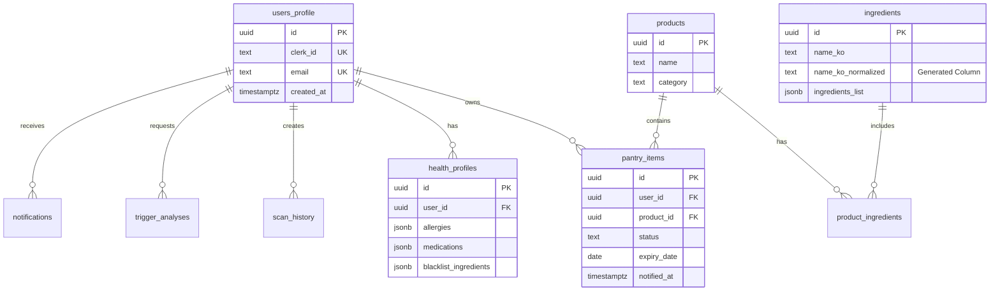

# TEND+ Cursor 구현 가이드

> **todo.md (v1.9) 기반 Cursor 실습용 가이드**  
> 쇼핑몰 예시와 동일한 방식으로 TEND+ 구현하기
>
> **✅ todo.md v1.9 기준** — 수정 #1~#22 반영, SETUP/PACKAGE는 todo.md 참조

---

## 📌 문서 사용 순서

1. **todo.md (v1.9)** — 메인 구현 가이드 (스키마, API, Phase Lock)
2. **SETUP.md** — Cursor 프롬프트·실습 흐름 참고
3. **PACKAGE.md** — 워크플로우·체크리스트 참고
4. **PLAN_MODE.md** — 플랜모드 사용 시 필독 (에러 75%→5% 감소)
5. **HUMAN_TASKS.md** — [HUMAN] 수동 작업 시 단계별 가이드
6. **CURSOR_LIMITS.md** — Cursor가 못하는 것 (에러 시 참조)

> **⚠️ 스키마/API 불일치 시:** todo.md를 우선합니다.  
> **플랜모드 사용 시:** PLAN_MODE.md 먼저 참조  
> **[HUMAN] 알림 시:** HUMAN_TASKS.md 열어서 수동 작업 진행  
> **에러/한계:** CURSOR_LIMITS.md 확인

---

## 📁 필요한 추가 파일

### 1. PRD.md (Product Requirements Document)
```markdown
# TEND+ v1.9 PRD

## 프로젝트 개요
- **핵심 목표**: 식품/화장품 성분 분석으로 건강 관리
- **검증 가설**: OCR + AI로 성분 위험도 자동 판별
- **출시 형태**: MVP (Phase 0-6)

## 기술 스택
- **Frontend**: Next.js 14 (App Router)
- **Backend**: Supabase (PostgreSQL)
- **인증**: Clerk
- **AI**: Google Gemini 2.0 Flash
- **Rate Limit**: Upstash Redis
- **Package Manager**: pnpm

## 타겟 사용자
- **연령대**: 20-40대
- **특징**: 알레르기/민감성 피부 보유, 건강 의식 높음

## 개발 우선순위
### Phase 0-6 (4주)
- Phase 0: 프로젝트 초기화
- Phase 1: 데이터베이스 (v1.9)
- Phase 2: 인증 (Clerk)
- Phase 3: AI 기능 (v1.9)
- Phase 4: 식약처 API
- Phase 5: Cron Job
- Phase 6: 배포

## 성공 지표
- 회원가입: 50명
- OCR 스캔: 100건
- 성분 분석: 80% 정확도
```

---

### 2. ERD 다이어그램 (Mermaid)



---

### 3. schema-tendplus-v1.9.sql

> **⚠️ 참고용:** 실제 스키마는 **todo.md Phase 1** 기준으로 생성. 아래는 요약.

```sql
-- ==========================================
-- TEND+ v1.9 스키마 (요약 - todo.md Phase 1 참조)
-- ==========================================

-- 1. users_profile (수정 #4, #5, #14)
CREATE TABLE users_profile (
  id uuid PRIMARY KEY DEFAULT gen_random_uuid(),
  clerk_id text UNIQUE NOT NULL,
  email text UNIQUE NOT NULL,
  display_name text,
  role text DEFAULT 'user' CHECK (role IN ('user', 'admin', 'super_admin')),
  status text DEFAULT 'active' CHECK (status IN ('active', 'suspended', 'deleted')),
  created_at timestamptz DEFAULT now()
);

-- 2. ingredients (v1.7 Generated Column)
CREATE TABLE ingredients (
  id uuid PRIMARY KEY DEFAULT gen_random_uuid(),
  name_ko text NOT NULL,
  
  -- ✅ v1.7: 자동 정규화
  name_ko_normalized text GENERATED ALWAYS AS (
    LOWER(REGEXP_REPLACE(REGEXP_REPLACE(name_ko, '[^가-힣a-zA-Z0-9]', '', 'g'), '\s+', '', 'g'))
  ) STORED,
  
  name_en text,
  ingredients_list jsonb DEFAULT '[]'::jsonb,
  allergens jsonb DEFAULT '[]'::jsonb,
  cached_at timestamptz,
  created_at timestamptz DEFAULT now()
);

CREATE UNIQUE INDEX idx_ingredients_normalized ON ingredients(name_ko_normalized);

-- 3. products
CREATE TABLE products (
  id uuid PRIMARY KEY DEFAULT gen_random_uuid(),
  name text NOT NULL,
  brand text,
  category text,
  image_url text,
  description text,
  created_at timestamptz DEFAULT now()
);

-- 4. health_profiles
CREATE TABLE health_profiles (
  id uuid PRIMARY KEY DEFAULT gen_random_uuid(),
  user_id uuid REFERENCES users_profile(id) ON DELETE CASCADE NOT NULL UNIQUE,
  allergies jsonb DEFAULT '[]'::jsonb,
  medications jsonb DEFAULT '[]'::jsonb,
  skin_concerns jsonb DEFAULT '[]'::jsonb,
  chronic_conditions jsonb DEFAULT '[]'::jsonb,
  blacklist_ingredients jsonb DEFAULT '[]'::jsonb,
  created_at timestamptz DEFAULT now(),
  updated_at timestamptz DEFAULT now()
);

-- 5. pantry_items (수정 #17: added_at)
CREATE TABLE pantry_items (
  id uuid PRIMARY KEY DEFAULT gen_random_uuid(),
  user_id uuid REFERENCES users_profile(id) ON DELETE CASCADE NOT NULL,
  product_id uuid REFERENCES products(id) NOT NULL,
  status text NOT NULL CHECK (status IN ('unopened', 'opened', 'almost_empty', 'empty')),
  added_at timestamptz DEFAULT now(),
  opened_at timestamptz,
  expiry_date date,
  notified_at timestamptz,
  created_at timestamptz DEFAULT now()
);

-- 6. 헬퍼 함수 (get_current_user_id, get_table_columns, get_expiring_items_kst)
-- ※ 전체 코드는 todo.md Phase 1 참조
CREATE OR REPLACE FUNCTION get_current_user_id()
RETURNS uuid AS $$
DECLARE
  clerk_id text;
  user_uuid uuid;
BEGIN
  clerk_id := auth.jwt()->>'sub';
  IF clerk_id IS NULL THEN RETURN NULL; END IF;
  
  SELECT id INTO user_uuid FROM users_profile
  WHERE users_profile.clerk_id = clerk_id LIMIT 1;
  
  RETURN user_uuid;
END;
$$ LANGUAGE plpgsql STABLE SECURITY DEFINER;

-- 7. RLS 정책
ALTER TABLE users_profile ENABLE ROW LEVEL SECURITY;
CREATE POLICY "Users can view own" ON users_profile FOR SELECT USING (id = get_current_user_id());

ALTER TABLE health_profiles ENABLE ROW LEVEL SECURITY;
CREATE POLICY "Users can view own health" ON health_profiles FOR SELECT USING (user_id = get_current_user_id());

ALTER TABLE pantry_items ENABLE ROW LEVEL SECURITY;
CREATE POLICY "Users can CRUD own pantry" ON pantry_items FOR ALL USING (user_id = get_current_user_id());

ALTER TABLE ingredients ENABLE ROW LEVEL SECURITY;
CREATE POLICY "Anyone can view ingredients" ON ingredients FOR SELECT USING (true);

ALTER TABLE products ENABLE ROW LEVEL SECURITY;
CREATE POLICY "Anyone can view products" ON products FOR SELECT USING (true);

-- 7-1. notifications, scan_history, product_ingredients (todo.md Phase 1)
CREATE TABLE notifications (
  id uuid PRIMARY KEY DEFAULT gen_random_uuid(),
  user_id uuid REFERENCES users_profile(id) ON DELETE CASCADE NOT NULL,
  type text NOT NULL,
  title text NOT NULL,
  body text,
  data jsonb,
  read boolean DEFAULT false,
  created_at timestamptz DEFAULT now()
);

CREATE TABLE scan_history (
  id uuid PRIMARY KEY DEFAULT gen_random_uuid(),
  user_id uuid REFERENCES users_profile(id) ON DELETE CASCADE NOT NULL,
  product_id uuid REFERENCES products(id) ON DELETE SET NULL,
  image_url text,
  ocr_result jsonb,
  created_at timestamptz DEFAULT now()
);

CREATE TABLE product_ingredients (
  id uuid PRIMARY KEY DEFAULT gen_random_uuid(),
  product_id uuid REFERENCES products(id) ON DELETE CASCADE NOT NULL,
  ingredient_id uuid REFERENCES ingredients(id) ON DELETE CASCADE NOT NULL,
  amount text,
  created_at timestamptz DEFAULT now(),
  UNIQUE(product_id, ingredient_id)
);

ALTER TABLE notifications ENABLE ROW LEVEL SECURITY;
CREATE POLICY "Users can view own notifications" ON notifications FOR SELECT USING (user_id = get_current_user_id());
CREATE POLICY "Users can update own notifications" ON notifications FOR UPDATE USING (user_id = get_current_user_id());

ALTER TABLE scan_history ENABLE ROW LEVEL SECURITY;
CREATE POLICY "Users can CRUD own scans" ON scan_history FOR ALL USING (user_id = get_current_user_id());

ALTER TABLE product_ingredients ENABLE ROW LEVEL SECURITY;
CREATE POLICY "Anyone can view product_ingredients" ON product_ingredients FOR SELECT USING (true);

-- 8. 인덱스
CREATE INDEX idx_pantry_user ON pantry_items(user_id);
CREATE INDEX idx_pantry_product ON pantry_items(product_id);
CREATE INDEX idx_pantry_status ON pantry_items(status);
CREATE INDEX idx_products_category ON products(category);
CREATE INDEX idx_notifications_user ON notifications(user_id);
CREATE INDEX idx_notifications_read ON notifications(read);

-- 9. 샘플 데이터 (개발용)
INSERT INTO products (name, category) VALUES
('크림 치즈', 'dairy'),
('아몬드 우유', 'dairy'),
('토마토 소스', 'sauce'),
('비타민C 세럼', 'cosmetics'),
('선크림 SPF50', 'cosmetics');
```

### 3-1. Storage RLS (✅ 수정 #5: Clerk JWT 호환)

Supabase Dashboard → Storage → Policies에서 추가:

```sql
-- product-images (공개)
CREATE POLICY "Public can view product images"
ON storage.objects FOR SELECT USING (bucket_id = 'product-images');

CREATE POLICY "Authenticated can upload product images"
ON storage.objects FOR INSERT
WITH CHECK (bucket_id = 'product-images' AND auth.role() = 'authenticated');

-- ocr-scans (인증된 사용자만)
CREATE POLICY "Authenticated can upload scans"
ON storage.objects FOR INSERT
WITH CHECK (bucket_id = 'ocr-scans' AND auth.role() = 'authenticated');

CREATE POLICY "Authenticated can view scans"
ON storage.objects FOR SELECT
USING (bucket_id = 'ocr-scans' AND auth.role() = 'authenticated');
```

---

## 🔧 수정해야 할 파일

### 1. todo.md 구조 조정

**현재 문제:**
- Phase별 Cursor 프롬프트가 너무 간단함
- 쇼핑몰 예시처럼 단계별 상세 프롬프트 필요

**수정 방향:**
```markdown
### Phase 1.1 스키마 생성

- [ ] **1.1.1** Supabase SQL Editor에서 스키마 실행

> **Cursor 프롬프트 (Planmode):**
> ```
> @todo.md Phase 1: 데이터베이스 - 스키마 생성을 구현하겠습니다.
> 
> 구현 목표:
> 1. schema-tendplus-v1.9.sql 파일 기반으로 스키마 생성 (todo.md Phase 1 참조)
> 2. Generated Column (name_ko_normalized) 포함
> 3. get_current_user_id() 함수 생성
> 4. RLS 정책 적용
> 
> 참고:
> - @schema-tendplus-v1.9.sql (또는 todo.md Phase 1 스키마)
> - @PRD.md
> 
> 검증 (Supabase SQL Editor에서 SQL 실행):
> - SELECT tablename FROM pg_tables WHERE schemaname = 'public';
> - SELECT column_name, is_generated FROM information_schema.columns 
>   WHERE table_schema = 'public' AND table_name = 'ingredients' AND column_name = 'name_ko_normalized';
> ```

> **검증 프롬프트:**
> ```
> @todo.md Phase 1 스키마(todo.md 또는 schema-tendplus-v1.9.sql)를 기반으로 스키마가 제대로 생성되었는지 확인해줘.
> 
> 확인 사항:
> 1. 모든 테이블 생성 확인
> 2. Generated Column 확인
> 3. 인덱스 생성 확인
> 4. RLS 정책 확인
> ```
```

---

### 2. .env.local 템플릿

> **⚠️ 전체 목록은 todo.md Phase 0.2 참조**

> **⚠️ 보안 주의사항 (2026년 1월 업데이트)**
> - Node.js v22.22.0 미만 또는 v20.20.0 미만 버전은 경로 탐색 우회 취약점(CVE-2025-27210) 존재
> - `.env.local` 파일이 `../../.env.local` 경로로 노출될 수 있음
> - **반드시 최신 Node.js 사용** + 아래 보안 설정 필수

**추가 보안 조치:**
1. `.env.local`을 `.gitignore`에 추가 (이미 포함됨 ✅)
2. Vercel 환경변수 설정 시 "Sensitive" 체크 ✅
3. **Windows 로컬 개발 시:**
   - 파일 탐색기에서 `.env.local` 우클릭 → 속성 → **보안** 탭 → 편집
   - 현재 사용자만 읽기/쓰기 권한 유지
   - **⚠️ 주의:** Windows Home 버전은 보안 탭 없음 → 파일 위치를 사용자 디렉토리 내로 유지 (기본값 ✅)
4. **최우선:** Node.js v22.22.0+ 또는 v20.20.0+ 사용 (CVE-2025-27210 방어)

```bash
# Clerk
NEXT_PUBLIC_CLERK_PUBLISHABLE_KEY=
CLERK_SECRET_KEY=
CLERK_WEBHOOK_SECRET=

# Supabase
NEXT_PUBLIC_SUPABASE_URL=
NEXT_PUBLIC_SUPABASE_ANON_KEY=
SUPABASE_SERVICE_ROLE_KEY=

# Upstash Redis
UPSTASH_REDIS_REST_URL=
UPSTASH_REDIS_REST_TOKEN=

# Gemini
GEMINI_API_KEY=

# Cron
CRON_SECRET=

# Rate Limit
RATE_LIMIT_FAIL_OPEN_THRESHOLD=20

# Encryption (Phase 9)
ENCRYPTION_KEY=

# Schema Verification
CURRENT_PHASE=0

# Phase 4 (식약처)
MFDS_API_KEY=

# Phase 13 (Resend 이메일)
RESEND_API_KEY=
```

---

### 3. 프로젝트 구조

```
tendplus/
├── src/
│   ├── app/
│   │   ├── (auth)/
│   │   │   ├── sign-in/
│   │   │   └── sign-up/
│   │   ├── api/
│   │   │   ├── ai/
│   │   │   │   └── ocr/route.ts
│   │   │   ├── webhooks/
│   │   │   │   └── clerk/route.ts
│   │   │   └── cron/
│   │   │       └── pantry-check/route.ts
│   │   ├── products/
│   │   │   ├── page.tsx (목록)
│   │   │   └── [id]/page.tsx (상세)
│   │   ├── scan/
│   │   │   └── page.tsx
│   │   ├── pantry/
│   │   │   └── page.tsx
│   │   └── layout.tsx
│   ├── components/
│   │   ├── Navbar.tsx
│   │   ├── scan/
│   │   │   └── CameraCapture.tsx
│   │   └── product/
│   │       └── ProductCard.tsx
│   └── lib/
│       ├── supabase/
│       │   ├── client.ts
│       │   └── server.ts
│       ├── api/
│       │   ├── rate-limiter.ts
│       │   └── mfds.ts
│       └── utils/
│           └── image-resize.client.ts
├── public/
├── schema-tendplus-v1.9.sql
├── scripts/
│   └── verify-schema.ts    # todo.md Phase 0.5
├── PRD.md
├── todo.md
├── .cursorrules
├── .env.local
└── vercel.json
```

---

## 📋 Cursor 실습 체크리스트

### Phase 0: 프로젝트 초기화

- [ ] **0.1** 프로젝트 생성
```bash
pnpm create next-app@latest tendplus --typescript --tailwind --app --src-dir
cd tendplus
```

- [ ] **0.2** 패키지 설치
```bash
pnpm add @supabase/supabase-js @clerk/nextjs @google/generative-ai \
  zustand lucide-react date-fns react-hot-toast svix \
  react-webcam recharts @hookform/resolvers react-hook-form zod \
  fast-xml-parser @upstash/ratelimit @upstash/redis resend

pnpm add -D @types/node tsx
```
> **참고:** resend는 Phase 13 가족 초대 이메일용 (todo.md Phase 0.1.2와 동일)

> **Cursor 프롬프트:**
> "@todo.md Phase 0.1-0.2를 구현해줘. package.json에 packageManager 'pnpm@8.15.0' 추가하고 필수 패키지 설치해줘."

- [ ] **0.3** .cursorrules 생성

> **Cursor 프롬프트:**
> "@todo.md Phase 0.3을 구현해줘. v1.9 규칙을 포함한 .cursorrules 파일 생성해줘."

- [ ] **0.4** 환경변수 설정

> **수동 작업:**
> - Supabase 프로젝트 생성
> - Clerk 프로젝트 생성
> - .env.local 파일에 키 입력

- [ ] **0.5** verify-schema 스크립트 (✅ 수정 #4)

> **Cursor 프롬프트:**
> "@todo.md Phase 0.5를 구현해줘. scripts/verify-schema.ts 생성"

---

### Phase 1: 데이터베이스

- [ ] **1.1** 스키마 생성

> **Cursor 프롬프트 (Planmode):**
> ```
> @todo.md Phase 1.1 - 스키마 생성을 구현하겠습니다.
> 
> 구현 목표:
> 1. @schema-tendplus-v1.9.sql 파일 생성 (todo.md Phase 1 스키마 참조)
> 2. Generated Column 포함
> 3. RLS 정책 적용
> 4. 헬퍼 함수 생성 (get_current_user_id, get_table_columns, get_expiring_items_kst)
> 
> 참고:
> - @PRD.md
> - @todo.md
> 
> 주의사항:
> - ingredients_list (NOT ingredients!)
> - notified_at (NOT notified!)
> - name_ko_normalized GENERATED ALWAYS AS ... STORED
> ```

- [ ] **1.2** 스키마 검증

> **검증 프롬프트:**
> ```
> Supabase SQL Editor에서 스키마가 제대로 생성되었는지 확인해줘.
> 
> 확인 SQL (Supabase SQL Editor는 \dt, \d 미지원):
> 1. SELECT tablename FROM pg_tables WHERE schemaname = 'public' ORDER BY tablename;
> 2. SELECT column_name, is_generated FROM information_schema.columns 
>    WHERE table_schema = 'public' AND table_name = 'ingredients' AND column_name = 'name_ko_normalized';
> 3. SELECT proname FROM pg_proc WHERE proname IN ('get_current_user_id', 'get_table_columns', 'get_expiring_items_kst');
> ```

- [ ] **1.3** 샘플 데이터 입력 (선택 — todo.md Phase 1 필수 아님)

> **Cursor 프롬프트:**
> "products 테이블에 샘플 데이터 5개 입력해줘. 카테고리: dairy, cosmetics, sauce"

---

### Phase 2: 인증

- [ ] **2.1** Clerk 통합

> **Cursor 프롬프트:**
> ```
> @todo.md Phase 2.2 - Clerk 통합을 구현하겠습니다.
> 
> 구현 파일:
> 1. src/lib/supabase/client.ts (useSupabaseClient)
> 2. src/lib/supabase/server.ts (createServerClient, createAdminClient, getCurrentUserId)
> 
> 주의사항:
> - .maybeSingle() 사용 (NOT .single()!)
> - JWT template 'supabase' 사용
> - getCurrentUserId()는 users_profile에서 clerk_id로 조회
> 
> 참고:
> - @PRD.md
> - @todo.md Phase 2
> ```

- [ ] **2.2** Webhook 설정

> **Cursor 프롬프트:**
> ```
> @todo.md Phase 2.3 - Webhook을 구현하겠습니다.
> 
> 구현:
> - src/app/api/webhooks/clerk/route.ts
> - user.created 이벤트 처리 (✅ 수정 #3: email null 체크 + user-${id}@placeholder.local)
> - user.updated 이벤트 처리 (이메일 변경 시 users_profile 동기화)
> - user.deleted 이벤트 처리 (✅ 수정 #6: GDPR 준수)
> - users_profile + health_profiles 생성
> - Svix 서명 검증
> - createAdminClient() 사용
> 
> 참고:
> - @todo.md Phase 2.3
> ```

- [ ] **2.3** 미들웨어 설정 (✅ 수정 #1)

> **Cursor 프롬프트:**
> ```
> @todo.md Phase 2.4 - 미들웨어를 구현해줘.
> 
> **🔴 CRITICAL: isPublicRoute에 반드시 '/api/cron(.*)' 포함!**
> - 없으면 Cron 요청이 auth.protect()에서 차단됨 (401 에러)
> 
> publicRoutes: /, /sign-in, /sign-up, /api/webhooks, **/api/cron**
> ```

---

### Phase 3: AI 기능

- [ ] **3.1** Rate Limiter

> **Cursor 프롬프트:**
> ```
> @todo.md Phase 3.1 - Rate Limiter를 구현하겠습니다.
> 
> 구현:
> - src/lib/api/rate-limiter.ts
> - Upstash Redis 사용
> - 10 req/min
> - Fail Closed after 20 failures
> 
> 주의사항:
> - failOpenCount 변수
> - MAX_FAIL_OPEN = 20
> - 성공 시 failOpenCount = 0
> 
> 참고:
> - @todo.md Phase 3.1
> ```

- [ ] **3.2** 이미지 리사이징

> **Cursor 프롬프트:**
> ```
> @todo.md Phase 3.2 - 클라이언트 이미지 리사이징을 구현하겠습니다.
> 
> 구현:
> - src/lib/utils/image-resize.client.ts
> - 파일명 .client.ts 필수!
> - 런타임 체크: if (typeof window === 'undefined') throw
> - maxWidth 768px, quality 0.8
> 
> 참고:
> - @todo.md Phase 3.2
> ```

- [ ] **3.3** OCR API

> **Cursor 프롬프트:**
> ```
> @todo.md Phase 3.3 - Gemini OCR API를 구현하겠습니다.
> 
> 구현:
> - src/app/api/ai/ocr/route.ts
> - Rate limit 체크
> - Gemini 2.0 Flash 사용
> - JSON 응답 파싱
> 
> 주의사항:
> - checkRateLimit(userId) 호출
> - getCurrentUserId() 사용
> - 429 에러 처리
> 
> 참고:
> - @todo.md Phase 3.3
> ```

---

## 🎯 구현 팁

### 1. Planmode 활용
```
매 Phase마다 Planmode로 계획 먼저 세우기
→ 계획 검토 후 구현 진행
→ todo.md 업데이트
→ 커밋
```

### 2. 단계별 검증
```bash
# 각 Phase 완료 후
pnpm dev  # 개발 서버 실행
# 브라우저에서 기능 테스트
# 에러 확인
```

### 3. 에러 해결
```
에러 발생 시:
1. 에러 메시지 전체 복사
2. 터미널 로그 복사
3. 브라우저 콘솔 에러 복사
4. Cursor에 제공: "이 에러를 고쳐줘"
```

### 4. 커밋 메시지
```bash
# Phase 단위로 커밋
git add .
git commit -m "feat: Phase 1.1 - 데이터베이스 스키마 생성"
git commit -m "feat: Phase 2.2 - Clerk 통합 완료"
```

---

## 📊 진행 상황 체크

### Phase 0-2 완료 시
- ✅ 프로젝트 초기화
- ✅ 데이터베이스 스키마
- ✅ Clerk 인증
- ✅ Webhook 동작

### Phase 3-5 완료 시
- ✅ Rate Limiter
- ✅ OCR 스캔
- ✅ 식약처 API
- ✅ Cron Job

### Phase 6 완료 시
- ✅ Vercel 배포
- ✅ 전체 기능 테스트
- ✅ MVP 완성!

---

**8주 후 TEND+ 완성!** 💪